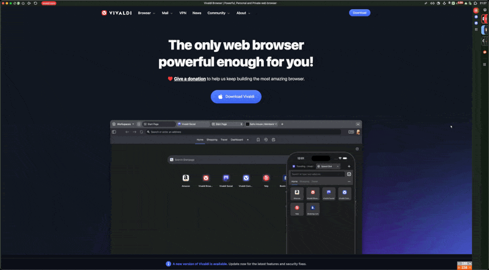
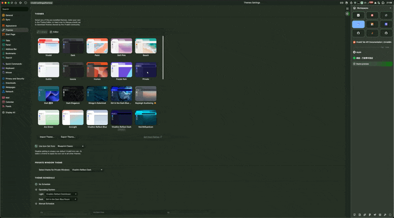
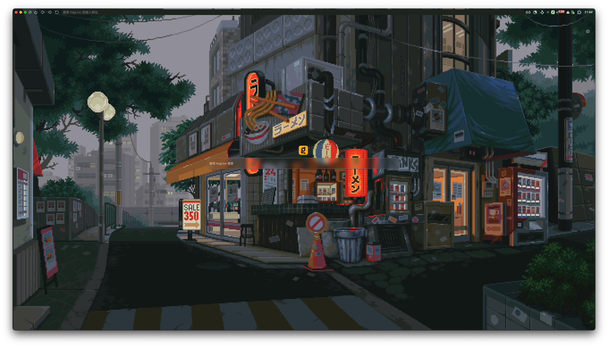
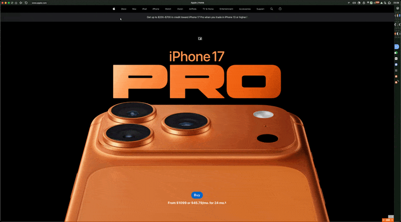
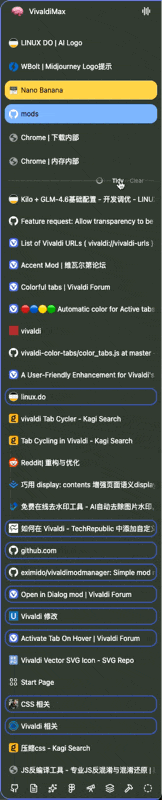
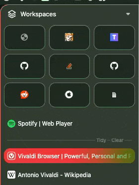
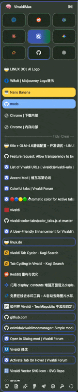
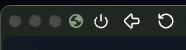

<div align="center">
    
</div>

<div align="center">
    <h1>Awesome Vivaldi</h1>
<div align="center">

[](https://deepwiki.com/PaRr0tBoY/Awesome-Vivaldi/2.3.1-main-ui-styles)
[](https://forum.vivaldi.net/topic/112064/modpack-community-essentials-mods-collection?_=1761221602450)


</div>
    <p>Vivaldi 浏览器精选社区修改包</p>

[English](../README.md) | **简体中文**

<!-- 


<br/>

<br/> -->

</div>

<br/>

# **功能特性**

## 屏幕截图
| 功能 | 预览 |
| :--- | :--- |
| **智能侧边栏动画**<br>• 流畅的展开/折叠过渡<br>• 智能显示/隐藏功能 |  |
| **动态主题颜色**<br>• 自动适应系统主题<br>• 平滑的颜色过渡效果 |  |
| **简洁新标签页**<br>• 极简界面布局<br>• 快速访问收藏网站 |  |
| **扩展网页视图**<br>• 优化的页面显示区域<br>• 增强的浏览体验 |  |

## **更多屏幕截图，点击展开**
<details>
<summary><h3> 让我们把它变成 Arc（不仅仅是外观） </h3></summary>

<table>
<tr>
<td>Arc 预览</td>
<td></td>
</tr>
<tr>
<td>AI 驱动的整理标签页</td>
<td></td>
</tr>
<tr>
<td>AI 驱动的整理标题</td>
<td></td>
</tr>
<tr>
<td>清除标签页</td>
<td></td>
</tr>
<tr>
<td>预览收藏标签页标题</td>
<td></td>
</tr>
<tr>
<td>固定收藏标签页</td>
<td></td>
</tr>
</table>

</details>

<details>
<summary><h3> 优化调整 </h3></summary>

<table>
<tr>
<td>流畅音频图标</td>
<td></td>
</tr>
<tr>
<td>全局媒体控制</td>
<td></td>
</tr>
<tr>
<td>谁需要禁用按钮？</td>
<td></td>
</tr>
<tr>
<td>从历史记录和下载中选择文件，来自 [@tam710562](https://forum.vivaldi.net/user/tam710562)</td>
<td></td>
</tr>
<tr>
<td>为悬停和活动标签页添加轨迹，以及关闭按钮</td>
<td></td>
</tr>
<tr>
<td>更大视图</td>
<td></td>
</tr>
</table>

</details>

> 以及更多...

# **如何安装**
> 在开始之前，有必要做一些声明。我的操作系统是 `macOS 15.7`，浏览器版本是 `Vivaldi 7.6.3797.58 (Stable channel) (arm64)`。因此，所有修改都针对此环境进行了优化。它们在 Windows 和 Linux 等其他平台上可能会有异常行为，但大多数修改仍然可以使用。你可以 fork 这个仓库并相应地进行适配，或者从这个仓库中选择特定模块使用。

### I. 调整 Vivaldi 设置

> 在 `外观 > 窗口外观` 下


> 在 `标签页 > 标签页功能` 下


> 在 `主题 > 编辑器 > 颜色` 下


> 在 `主题 > 编辑器 > 设置` 下


> 在 `起始页 > 快速拨号` 小图标


> 在 `面板 > 面板选项` 小图标


> 在 `地址栏 > 地址栏` 下
  - 勾选 `显示地址栏`

> 在 `书签 > 书签栏` 下
  - 勾选 `显示书签栏`
  - 勾选 `书签栏位置 > 顶部`

> 在 `搜索 > 搜索选项` 下
  - 勾选 `在快速拨号上显示搜索字段`

> 编辑工具栏按钮


> 有关类似 Arc 的工作区切换按钮的更多信息，请参阅 [Paweł 向您展示如何在 Vivaldi 中使用工作区和自定义图标。](https://vivaldi.com/blog/how-to/pawel-shows-you-how-to-play-with-workspaces-and-custom-icons-in-vivaldi/)

## II. 安装修改

==**开始前备份所有必要文件**==

### 安装 CSS：

1. 在 Vivaldi 中打开 'Vivaldi://experiments' 并勾选 '允许 CSS 修改'
2. 重启 Vivaldi
3. 克隆此仓库
4. 在 'CSS/' 下有一个名为 'Core.css' 的文件，它会导入此修改包中的所有 css 修改，
   你还可以在此修改包中找到所有 css 修改的所有配置；
   这意味着你可以在一个地方打开/关闭所有 css 修改，并在更新时保持你的配置。
5. 转到 设置->外观，你会看到 '自定义 UI 修改'。选择文件位置为 "/path/to/Awesome-Vivaldi/CSS"
6. 重启 Vivaldi，一切就绪！

### 安装 JavaScript 修改

#### 自动安装

1. 如果你在 Windows 上，使用 [Vivaldi Mod Manager](https://github.com/eximido/vivaldimodmanager)
2. 如果你在 Linux 上，请参阅 [Vivaldi-Autoinject-Custom-js-ui](https://aur.archlinux.org/vivaldi-autoinject-custom-js-ui.git) 获取更多信息
3. 另请参阅 [使用批处理脚本修补 Vivaldi](https://forum.vivaldi.net/topic/10592/patching-vivaldi-with-batch-scripts/21?page=2) 适用于所有平台
4. 如果你在 macOS 上，使用 [macOS_Patch_Scripts | upviv](https://github.com/PaRr0tBoY/Vivaldi-Mods/blob/8a1e9f8a63f195f67f27ab2e5b86c4aff0081096/macOS_Patch_Scripts/upviv) 作为修补脚本的参考

#### 手动安装

1. 将 moddings 下的 javascript 文件复制到 `<YOURVIVALDIDIRECTORY>`\Application\<VERSI0N>\resources\vivaldi。
2. 在同一文件夹下，有一个 window.html 文件，你应该在 `<body>` 中逐一填入你的 js 文件名，之后
   你的 window.html 应该看起来像这样。

```html
<!-- Vivaldi window document -->
<!DOCTYPE html>
<html>
<head>
  <meta charset="UTF-8" />
  <title>Vivaldi</title>
  <link rel="stylesheet" href="style/common.css" />
  <link rel="stylesheet" href="chrome://vivaldi-data/css-mods/css" />
</head>

<body>
<script src="tidyTitles.js"></script>\
<script src="tidyTabs.js"></script>\
<script src="clearTabs.js"></script>\
<script src="mainbar.js"></script>\
<script src="wrapToday.js"></script>\
<script src="immersiveAddressbar.js"></script>\
<script src="monochromeIcons.js"></script>\
<script src="ybAddressBar.js"></script>\
<script src="mdNotes.js"></script>\
<script src="elementCapture.js"></script>\
<script src="globalMediaControls.js"></script>\
<script src="autoHidePanel.js"></script>\
<script src="easyFiles.js"></script>\
<script src="dialogTab.js"></script>\
<script src="feedIcon.js"></script>\
<script src="adaptiveWebPanelHeaders.js"></script>\
<script src="collapseKeyboardSettings.js"></script>\
<script src="accentMod.js"></script>\
<script src="moonPhase.js"></script>\
<script src="backupSearchEngines.js"></script>\
<script src="importExportCommandChains.js"></script>\
<script src="tabScroll.js"></script>\
<script src="activateTabOnHover.js"></script>\
</body>

</html>

```

3. 就这样！你都设置好了。如果有任何其他问题，请在 [Issues · PaRr0tBoY/Awesome-Vivaldi](https://github.com/PaRr0tBoY/Awesome-Vivaldi/issues?q=sort%3Aupdated-desc+is%3Aissue+is%3Aopen) 报告，我会在周末~~可能~~修复它。

> 可选：在这里获取 glm api 密钥用于 AI 功能 [这里](https://open.bigmodel.cn/usercenter/proj-mgmt/apikeys)。仅供参考，它是实验性的且不稳定。你也可以使用其他 AI 提供商的 api，只要它与 OpenAI api 兼容。

### III. 高级阅读

1. 你可以使用批处理脚本修补 vivaldi。了解更多请查看 [使用批处理脚本修补 Vivaldi](https://forum.vivaldi.net/topic/10592/patching-vivaldi-with-batch-scripts/21?page=2)
2. 要了解 Vivaldi 的 `js 修改` 的更多信息，请查看 [Modding Vivaldi | Vivaldi Forum](https://forum.vivaldi.net/topic/10549/modding-vivaldi?page=1)
3. 要自行了解 Vivaldi 的 `css 修改` 的更多信息，请查看 [使用 DevTools 检查 Vivaldi UI | Vivaldi Forum](https://forum.vivaldi.net/topic/16684/inspecting-the-vivaldi-ui-with-devtools?page=1)
4. 如果你在 macOS 上，使用 [macOS_Patch_Scripts | upviv](https://github.com/PaRr0tBoY/Vivaldi-Mods/blob/8a1e9f8a63f195f67f27ab2e5b86c4aff0081096/macOS_Patch_Scripts/upviv) 作为修补脚本的参考
5. 类似 Arc 的工作区切换器教程：[Paweł 向您展示如何在 Vivaldi 中使用工作区和自定义图标。 | Vivaldi Browser](https://vivaldi.com/blog/how-to/pawel-shows-you-how-to-play-with-workspaces-and-custom-icons-in-vivaldi/)

</details>

<details>
<summary><h1>社区修改</h1></summary>

# 此修改包中包含的社区 JS 修改和 CSS

[📸 元素捕获](https://forum.vivaldi.net/topic/103686/element-capture?_=1758777284963)

> 此修改添加了在截屏时自动选择区域进行捕获的功能。

[彩色标签页](https://forum.vivaldi.net/topic/96586/colorful-tabs?_=1758775816485)

> 从图标计算颜色的部分代码

[单色图标](https://forum.vivaldi.net/topic/102661/monochrome-icons?_=1758775889576)

> 此修改更改所有网页面板图标的色调，使其成为单色。网页面板会使面板变得过于繁忙，颜色到处都是，因此稍微降低它们的色调并让它们更好地融合是有意义的。

[导入导出命令链](https://forum.vivaldi.net/topic/93964/import-export-command-chains?page=1)

> 此修改帮助导入和导出 Vivaldi 的命令链。
> 此修改附带通过 Vivaldi 论坛的代码块 (```) 直接安装导出代码的功能。

[📂 简便文件](https://forum.vivaldi.net/topic/94531/easy-files?page=1)

> 此修改受 Opera 启发。通过显示剪贴板中的文件和下载的文件，使附加文件更容易。

[点击添加阻止列表](https://forum.vivaldi.net/topic/45735/click-to-add-blocking-list)

> 此修改添加了通过点击网站中的链接来添加阻止列表的支持，类似其他广告拦截器。

[全局媒体控制面板](https://forum.vivaldi.net/topic/66803/global-media-controls-panel)

> 此修改将在 vivaldi 的面板中添加全局媒体控制，类似于 Chrome 中的全局媒体控制

[笔记的 Markdown 编辑器](https://forum.vivaldi.net/topic/35644/markdown-editor-for-notes)

> 笔记编辑器的简单 Markdown 编辑器

[鼠标悬停时打开面板](https://forum.vivaldi.net/topic/28413/open-panels-on-mouse-over/22?_=1593504963587)

> 鼠标悬停到正文时自动关闭
> 如果在超时期限前鼠标退出屏幕则不打开
> 基于情况的独特延迟

[仪表板伪装：仪表板网页的主题集成](https://forum.vivaldi.net/topic/102173/dashboard-camo-theme-integration-for-dashboard-webpages/3)

> 它获取 Vivaldi 根据你的主题设置的所有自定义 CSS 属性，并将它们传递给所有网页小部件，你可以在其中使用它们来设置你的自定义小部件的样式。

[彩色顶部加载栏](https://forum.vivaldi.net/topic/111621/colorful-top-loading-bar?_=1758776810153)

> 使 Vivaldi 的标题栏在网页加载时视觉上吸引人的 JS 和 CSS。

[Feed 图标](https://forum.vivaldi.net/topic/73001/feed-icons?_=1758776884927)

> 这是一个将 feed 图标转换为网站图标的小修改。

[类似 Yandex 浏览器的地址栏](https://forum.vivaldi.net/topic/96072/address-bar-like-in-yandex-browser?_=1758776929535)

> 使地址栏显示当前页面的标题和域，点击该域可进入网站的主页。

[在对话框中打开修改](https://forum.vivaldi.net/topic/92501/open-in-dialog-mod/95?_=1758776959371)

> 在对话框弹出窗口中打开链接或搜索的修改。

[两级标签堆栈的自动展开和折叠标签栏：重做](https://forum.vivaldi.net/topic/111893/auto-expand-and-collapse-tabbar-for-two-level-tab-stack-rework?_=1758777265037)

> 自动展开和折叠标签栏

[两级标签堆栈的自动展开和折叠标签栏：重做](https://forum.vivaldi.net/topic/111893/auto-expand-and-collapse-tabbar-for-two-level-tab-stack-rework?_=1758777265037)

> 自动展开和折叠标签栏

[主题预览增强 | Vivaldi Forum](https://forum.vivaldi.net/topic/103422/theme-previews-plus?_=1759122196203)

> 使主题预览正确反映你的标签栏、地址栏和面板栏的实际位置，以及在启用时显示浮动标签页。
>
> 注意：此修改仅在设置页面在标签页中打开时有效（在 vivaldi://settings/appearance/ 中启用"在标签页中打开设置"）。

[tovifun/VivalArc: 只需几个调整，你就可以给 Vivaldi 那种酷炫的 Arc 感觉](https://github.com/tovifun/VivalArc)

> 使用了此仓库中的部分代码。

</details>

---

[](https://github.com/PaRr0tBoY/Awesome-Vivaldi)

